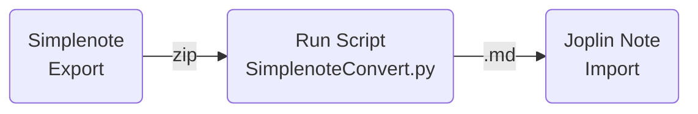

# Simplenote to Joplin Converter

## Purpose of Project

The purpose of this project is to convert Simplenote to Joplin note.

### Why am I doing this project

I had used KeepNote for years. It is a good note taking software and
I am very happy with it. However, it stops its maintenance about 10 years ago 
which force me to look into different solutions. 
Then, I started my searching of an ideal note taking application for myself.

I have tried several note taking applications. Each one has their advantages 
and disadvantages but none of them meet my requirements. 
However, searching and making conclusion require time. But I need some 
replacement to use before I found my final solution. Therefore,
Simplenote had filled in this gap. 

After a few months of testing on different application, I found that Joplin 
it is the closest of what I want. 
(See below for missing features, on my wish list, of Joplin.)
I have been using Joplin for more than 6 months now. 
Then, I need to convert some notes done by Simplenote to Joplin. 

This is why a little script was written.

## Installation

The script itself could run without installation. Just copy the script
"SimplenoteConvert.py" to any directory and run it. See the section 
"help option" below for actual command and options of running this script.


## Requirements and Dependencies

1. Python 3.7
2. Python library "pathvalidate" 

In most cases, to install "pathvalidate" just run the following command 
in a terminal will be enough. For more information please check [here][lib-1].

    $ pip install pathvalidate


## How to use 

To convert Simplenote to Joplin. following the steps below.
1. (In Simplenote) Export Simplenote (which is a Zip file).
2. Run script `SimplenoteConvert.py` to convert files to Joplin compatible "MD - Markdown + Front Matter" format
3. (In Joplin) Import "MD - Markdown + Front Matter (Directory)"


### help option

Run `SimplenoteConvert --help` will return the following info.

```
usage: SimplenoteConvert.py [-h] [-v] [-d] f_in f_out

Convert Simplenote to Joplin note.

positional arguments:
  f_in        input file => zip file exported from Simplenote.
  f_out       output directory for files after conversion

optional arguments:
  -h, --help  show this help message and exit
  -v, --verb  turn on the verbose mode
  -d, --dry   Dry run ......
```


## Known Issues

1. Simplenote accepts links like `[link-1]:  (http://.....   ) `
    but Joplin doesn't.    
    
    Current converter doesn't take care of this issue.


## Wish List or Missing Features

To be completed.

[lib-1]:  https://pypi.org/project/pathvalidate/#installation  


